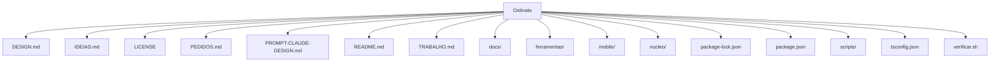
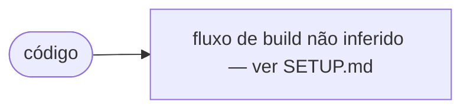

# Architecture — Ostinato

## Overview

A student planner that warns you **before** the deadline, and keeps insisting until you answer.

## Stack (extraído do repositório)

| Camada | Tecnologia | Versão / nota |
| --- | --- | --- |
| Runtime / package | Node (`ostinato`) | 0.1.0 |
| TypeScript | dependência | ~5.9 |

## Alvos / targets

_Sem `project.yml` com targets, ou projeto não-Xcode._

## Diagrama de pastas (topo)

## Fluxo de build (inferido)

