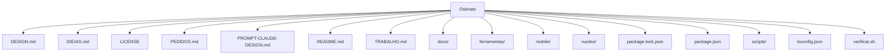

# Estrutura — Ostinato

## Pastas de topo

```
Ostinato/
├── DESIGN.md
├── IDEIAS.md
├── LICENSE
├── PEDIDOS.md
├── PROMPT-CLAUDE-DESIGN.md
├── README.md
├── TRABALHO.md
├── docs/
├── ferramentas/
├── mobile/
├── nucleo/
├── package-lock.json
├── package.json
├── scripts/
├── tsconfig.json
├── verificar.sh
```

## Diagrama



## Componentes / módulos importantes

_Sem pastas de módulo padrão detectadas._
